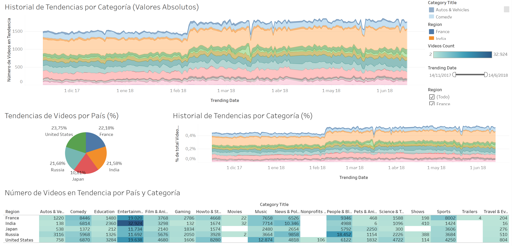

# 📈 Análisis de Tendencias de Videos en YouTube

## Descripción

Este proyecto analiza las tendencias de videos de YouTube utilizando Tableau para identificar patrones por país, categoría y periodo de tiempo mediante un dashboard interactivo.

## Dashboard

El dashboard permite:

- Analizar la evolución temporal de las tendencias.
- Comparar la distribución de videos por país.
- Explorar categorías con mayor cantidad de videos.
- Filtrar la información por fecha y región.

## Tecnologías utilizadas

- Tableau
- Tableau Public
- Análisis de datos
- Visualización de datos

## Tableau Public

Enlace al dashboard interactivo:
https://public.tableau.com/views/dashboard-tableau_17829454736410/AnlisisdeTendenciasdeVideosporReginyCategora?:language=en-US&publish=yes&:sid=&:redirect=auth&:display_count=n&:origin=viz_share_link

